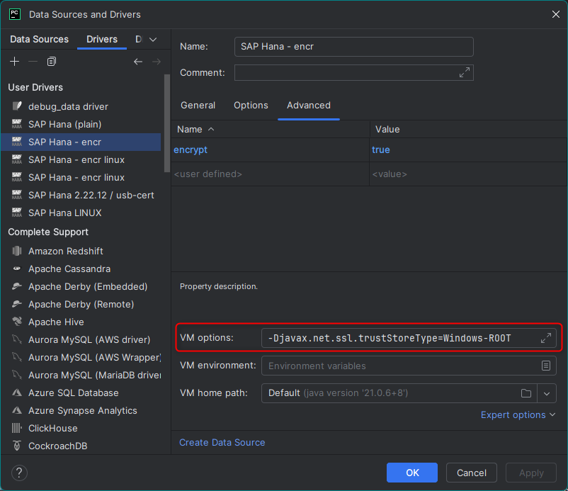

Test excerpt only with delimiter

<!--end_excerpt-->


Abhängig von OS und Technologie können Zertifikate verschieden verwendet werden.
Folgend wird auf die verschiedene Zertifikate Stores eingeangen: Windows, Unix und JKS (für Win und Unix).

# Ausgangslage
- Für SAP HANA Connections sollen intern signierte Zertifikate verwendet werden.
- Es gibt eine interne CA, die Certs austellt.
- Die Datenbank Verbindung kann grundsätzlich via JDBC oder hdbcli erfolgen.
  - **jdbc:** Jetbrains Database Extension (Datagrip oder integriert in PyCharm) sowie DBeaver verwenden jdbc.
  - **hdbcli:** Python verwendet entweder direkt das native `hdbcli` Package oder dann dasselbe via sqlalchemy (`sqlalchemy-hana`)
- Der Zugriff kann von Windows oder Unix erfolgen.

# Cert Stores
Root-Zertifikate können entweder direkt als File (crt/pem) verwendet werden oder via einen Cert Store, der die Zertifikate geschützt zur Verfügung stellt:
- **Windows** bietet dazu die Programme "Manage computer / user certifcates" (direkt via Start Menu) an. Resp. kann via MMC verwendet werden.
- **Linux** hat das Package `ca-certificates` mit dem Befehl `update-ca-certificates`
  ```bash
  apt install -y ca-certificates
  cp local-ca.crt /usr/local/share/ca-certificates
  update-ca-certificates
  ```
- **Java** hat ein eigenes Dateiformat `jks` (java keystore), das mit dem Programm `keytool` verwaltet werden kann.
  - In Windows kann Java direkt den Windows Cert Store verwenden, dazu muss die VM Option: `-Djavax.net.ssl.trustStoreType=Windows-ROOT` angegeben werden. Ansonsten muss der Pfad zu einem `jks` angegeben sein.
  - In Linux wird mit `ca-certificates-java` automatisch beim ausführen von `update-ca-certificates` ein `jks` mit allen system-weiten Root-Zertifikate erstellt. Dieses liegt hier: `/etc/ssl/certs/java/cacerts`
  - der JKS ist immer mit einem Passwort geschützt, standardmässig mit: `changeit`


# DB Clients
* [SAP HANA Client Interface Programming Reference
](https://help.sap.com/docs/SAP_HANA_CLIENT/f1b440ded6144a54ada97ff95dac7adf/ce5509c492af4a9f84ee519d5659f186.html)
* Windows
  * `hdbcli`: verwendet standardmässig automatisch den Windows Store
  * `jdbc`: falls `-Djavax.net.ssl.trustStoreType=Windows-ROOT` ebenfalls den Windows Store
    * **DBeaver:** verwendet standardmässig den Windows Store
    * **PyCharm:** verwendet grundsätzlich auch den Windows Store, allerdings läuft jede Database Connection in einer eigenen JAVA VM, dort wird der Windows Store nicht verwerwendet.
    
* Linux
  * `hdbcli`: dem `dbapi.connect()` muss das Argument `sslTrustStore = '/etc/ssl/certs/ca-certificates.crt'` mitgegeben werden.
    * `sqlalchemy`: Connection String muss wie folgt erweiter werden`&sslTrustStore=/etc/ssl/certs/ca-certificates.crt`
    * Platformunabhängiger Code kann beispielsweise so aussehen:
      ```python
      from sys import platform
      if platform.startswith("linux"):
        # for hdbcli
        sslTrustStore = '/etc/ssl/certs/ca-certificates.crt'
        # for sqlalchemy
        conn_str_hana = 'hana://DB_USER:DB_PASSWORD@DB_ADDRESS:/?encrypt=true&sslTrustStore=/etc/ssl/certs/ca-certificates.crt'
      end
      ```
  * `jdbc`: falls `-Djavax.net.ssl.trustStoreType=Windows-ROOT` ebenfalls den Windows Store
    * ~~**DBeaver:** verwende ich nicht auf Linux.~~
    * **PyCharm:** trust Store von Linux muss angegeben werden:
    


# SAP HANA und Zertifikate
HANA hat standardmässig selbstsignierte Zertifikate.
Das aktuelle public Zertifikat einer HANA DB kann wie folgt abgerufen werden:
```bash
</dev/null openssl s_client -connect db.sap.hana.com:12345 | openssl x509 > db.sap.hana.com:12345.pem

# to display the cert
openssl x509 -in db.sap.hana.com:12345.pem -text -noout
# or display the fingerprint
openssl x509 -in db.sap.hana.com:12345.pem -fingerprint -sha256
```

Soll das self-signed Cert in einen `jks` importiert werden:
```bash
# contains also keytool
sudo apt install default-jdk-headless

keytool -importcert -alias 'db.sap.hana.com:12345' -file "db.sap.hana.com.pem" -keystore my_certs.jks

# display all keys inside a jks
keytool -list -keystore my_certs.jks -v -storepass changeit
```
